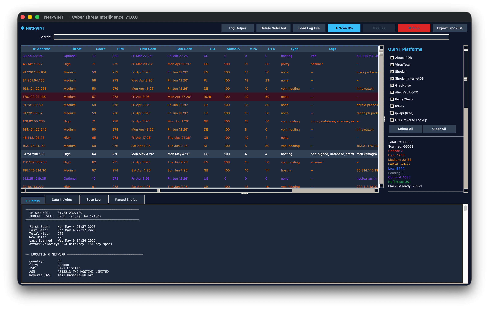

# NetPyINT — Cyber Threat Intelligence Tool

A Python GUI desktop application for firewall log analysis, multi-source OSINT agregating, and automated threat scoring. NetPyINT parses WAN reject and banIP logs, queries 10 threat intelligence platforms, scores each IP on a 0–100 composite scale, and exports dated blocklists ready for router import.

NetPyINT's two supported log formats: the default `reject wan in` firewall log line and `banIP/inbound/drop/*` entries are created by **OpenWRT** (the stock firewall and the popular banIP blocklist package). Any firewall with matching log syntax will parse but OpenWRT is the primary focus.



## Features

- **Log parsing** — Two firewall log formats: WAN reject (`reject wan in`) and banIP drop (`banIP/inbound/drop/*`), both native to OpenWRT. Extracts source/destination IPs, ports, protocols, and timestamps with automatic deduplication and hit counting.
- **10 OSINT platforms** — Queries AbuseIPDB, VirusTotal, Shodan, Shodan InternetDB, GreyNoise, AlienVault OTX, ProxyCheck, IPInfo, ip-api.com, and DNS reverse lookup in a single scan pass.

- **Three-state classification** — Pending → Partial → Final. IPs stay at Pending until at least one platform reports data, then move to Partial until all KEY platforms (AbuseIPDB + VirusTotal) have reported, at which point they receive a final threat level.
- **Weighted threat scoring** — Composite 0–100 score from multiple sources with configurable weights, mapped to six severity levels (Critical, High, Medium, Low, Optional, No Threat).
- **Parallel Scanning** — Configurable parallel scan workers (1–8) for faster throughput when API rate limits allow with pause, resume, and stop controls.
- **Auto Start Scan** — Optional recurring timer that rescans the currently filtered IP set on a configurable interval (1–24 hours), with an optional 5 minute post scan buffer before the next cycle.
- **Advanced Filter Controls** — Collapsible sidebar panel for score range, first/last seen recency, hit count threshold, ASN/ISP substring search, and country multi select. AND combines with the existing coverage filter and drives the main table, Data Insights, and Recalculate Levels. Criteria combinations can be saved as named presets.
- **Multi-source reverse DNS** — DNS PTR lookup is the authoritative source; when no PTR record exists, hostnames already returned by ip-api, IPInfo, Shodan, or InternetDB fill the gap in that priority order. Already stored scan data is retroactively backfilled at startup with no extra API calls.
- **SQLite persistence** — All IP data, scan results, and audit logs stored in a local indexed database 
- **Export blocklists** — Export identified IPs by severity, live IP counts, and dated output file formatted for OpenWRT router import.
- **Export / Import full report (JSON)** — Export the entire database as a JSON file. Ability to re import it to restore or merge records on another installation.
- **Data Insights** — Analytics tab showing score statistics, threat breakdown, country distribution, platform coverage, vulnerability summary, temporal activity, recidivism metrics, ASN/ISP rankings, protocol/port patterns, ProxyCheck and OTX distributions, tag cooccurrence, new hit surges, and scan health filtered to the current table view (coverage filter, search term, and Advanced Filter Controls).
- **Search bar** —  SQL driven search across IP, country, reverse DNS, threat level, GreyNoise class, and ProxyCheck columns. 
- **Country code highlight** — Configure a watchlist of country codes; matching rows get a highlighted background in the CC column.
- **Scan log retention** — Automatic and on demand pruning of old scan_log audit rows, with configurable retention window.
- **Auto-stop on rate limits** — Automatically halts scanning when every active platform has hit consecutive rate limit errors.
## Requirements

- Python 3.10 or later
- Tkinter (included with most Python installations)
- No third party packages required. Uses only the Python standard library

## Quick Start

```bash
python3 netpyint_main.py
```

On first launch, NetPyINT creates `netpyint_config.json` in the working directory with empty API key fields and default settings. The tool is fully functional without any API keys, but platform coverage will be limited to keyless services (InternetDB, OTX, ip-api.com, DNS).

### Adding API Keys

Go to **Settings → API Keys** and enter keys for any platforms you have accounts with:

| Platform | Where to Get a Key | Free Tier |
|---|---|---|
| AbuseIPDB | [abuseipdb.com/account/api](https://www.abuseipdb.com/account/api) | 1,000 checks/day |
| VirusTotal | [virustotal.com/gui/my-apikey](https://www.virustotal.com/gui/my-apikey) | 4 lookups/min |
| Shodan | [account.shodan.io](https://account.shodan.io/) | Paid only |
| GreyNoise | [viz.greynoise.io/account/api-key](https://viz.greynoise.io/account/api-key) | Community (free) |
| ProxyCheck | [proxycheck.io/dashboard](https://proxycheck.io/dashboard/) | 1,000 queries/day |
| IPInfo | [ipinfo.io/account/token](https://ipinfo.io/account/token) | 50,000/month |

Platforms that don't need a key:

| Platform | Service URL | Free Limit | What It Provides |
|---|---|---|---|
| **Shodan InternetDB** | [internetdb.shodan.io](https://internetdb.shodan.io) | Unlimited (no auth) | Open ports, CVEs, CPE identifiers, threat tags |
| **AlienVault OTX** | [otx.alienvault.com](https://otx.alienvault.com) | 100 queries/hour | Threat intelligence pulses linking IPs to known campaigns |
| **ip-api.com** | [ip-api.com](https://ip-api.com) | 45 requests/min | Country, city, ISP, ASN, proxy/hosting detection |
| **DNS Reverse Lookup** | System resolver (no HTTP) | No limit | PTR record for the IP address |

### Loading Logs

Click **Load Log** and select a firewall log file. NetPyINT parses both formats automatically. Both are native to OpenWRT (the stock firewall reject line and the banIP package's drop line):

```
Mon Mar 23 13:16:49 2026 kern.warn kernel: [311423.870453] reject wan in: IN=eth1 OUT= SRC=118.123.1.39 DST=10.0.0.1 PROTO=TCP SPT=12345 DPT=22
```

```
Mon Mar 23 13:16:46 2026 kern.warn kernel: [311420.900353] banIP/inbound/drop/country.v4: IN=eth0 OUT= SRC=85.217.149.48 DST=10.0.0.1 PROTO=UDP SPT=9999 DPT=53
```

IPs are aggregated by address with hit counts, port sets, protocol sets, and timestamp ranges. Private IPs are automatically excluded. Scores are computed immediately after import so the Score column sorts correctly without a restart.

### Log Helper

Click **Log Helper** to open the companion `log_helper.py` utility. It handles cleaning, date filtering, and WAN IP redaction of raw firewall log files before they are imported into NetPyINT.

### Scanning

Click **Scan IPs** to begin querying all enabled platforms for every loaded IP. The scan runs in a background thread. Use **Pause**, **Resume**, or **Stop** at any time. Progress and per IP results stream to the Scan Log tab. Enable **Auto Start Scan** in the sidebar to have NetPyINT rescan the currently filtered IP set automatically on a timer instead of triggering scans manually.

## OSINT Platforms

### KEY Platforms (required for final threat level)

| Platform | Weight | What It Provides |
|---|---|---|
| **AbuseIPDB** | 35% | Crowd sourced abuse confidence score (0–100) from sysadmin reports |
| **VirusTotal** | 25% | Percentage of 70+ scanning engines flagging the IP as malicious |

Both must successfully report before an IP moves from Partial to a final threat level. This prevents incomplete data from generating misleading low scores.

### Supplementary Platforms

| Platform | Scoring Impact | What It Provides |
|---|---|---|
| **Shodan** | Up to +10 pts (CVEs) | Open ports, known vulnerabilities, ISP/ASN, operating system, hostnames (reverse DNS fallback) |
| **Shodan InternetDB** | Up to +10 pts (CVEs) + up to +5 pts (tags) | Free alternative to Shodan: ports, CVEs, CPE identifiers, tags (malware, c2, tor, eol-os), hostnames (reverse DNS fallback) |
| **GreyNoise** | ±10 pts | Mass scanner classification: malicious (+10), benign (−5), unknown (0) |
| **AlienVault OTX** | Up to +10 pts | Pulse count linking IP to known threat campaigns |
| **ProxyCheck** | Up to +5 pts (purely additive) | Proxy/VPN/Tor/scraper detection, risk score, operator info, attack history |
| **IPInfo** | Context only | Geolocation, ASN ownership, hostname (reverse DNS fallback) |
| **ip-api.com** | Context only | Country, city, ISP, proxy/hosting flags, hostname (reverse DNS fallback) |
| **DNS Reverse Lookup** | Context only | PTR record for the IP address and the primary authoritative reverse DNS source |

### Reverse DNS Fallback Chain

DNS Reverse Lookup is authoritative: if it resolves a PTR record, that value always wins, including overwriting a value an earlier scan backfilled from a lower priority platform. When DNS returns nothing, NetPyINT falls back to hostnames already present in other platforms responses in priority order:

1. DNS Reverse Lookup
2. ip-api (free)
3. IPInfo
4. Shodan
5. Shodan InternetDB

A fallback platform only writes the Reverse DNS field when it is still blank. At startup, every IP with a blank Reverse DNS field is rechecked against its already stored scan data.

## Threat Scoring

### Composite Score (0–100)

| Source | Weight/Max | Notes |
|---|---|---|
| AbuseIPDB confidence | 35% of score | `score × 0.35` |
| VirusTotal malicious % | 25% of score | `score × 0.25` |
| Vulnerabilities (Shodan + InternetDB CVEs) | Up to 10 pts | +3 per unique CVE, capped |
| InternetDB threat tags | Up to 5 pts | +2 per tag: malware, c2, tor, eol-os, eol-product |
| GreyNoise classification | ±10 pts | malicious +10, benign −5 |
| AlienVault OTX pulses | Up to 10 pts | +2 per pulse, capped |
| ProxyCheck detections | Up to 5 pts | Tor +5, proxy/VPN +3, scraper +2 (purely additive, capped) |
| Local hit frequency | Up to 10 pts | 100+ hits = +10, 50+ = +7, 20+ = +5, 5+ = +3 |

### Score → Threat Level Mapping

| Score Range | Level | Recommended Action |
|---|---|---|
| ≥ 80 | **Critical** | Immediate block |
| ≥ 60 | **High** | Strong evidence of malicious activity |
| ≥ 40 | **Medium** | Moderate suspicion, worth blocking |
| ≥ 20 | **Low** | Minor flags, monitor |
| ≥ 5 | **Optional** | Negligible risk |
| < 5 | **No Threat** | Benign |

### Three-State Classification

1. **Pending** — No platform has successfully scanned this IP. Freshly loaded IPs start here. IPs where every scan attempt errored also stay here.
2. **Partial** — At least one platform has reported data, but KEY platforms (AbuseIPDB + VirusTotal) haven't both reported yet. Score is computed but may be unreliable.
3. **Final** — All KEY platforms have reported. Score is mapped to a threat level above.

Note: CVE data from paid Shodan and free InternetDB are merged into a deduplicated set before scoring, so the same CVE found by both platforms is only counted once.

## Advanced Filter Controls

Optional filters to sort IP table data. **Settings → Start with Advanced Filters Hidden** to change the launch behaviour.

| Control | Type | Behaviour |
|---|---|---|
| Score min/max | Dual slider + numeric entry | Threat score between the two bounds (0–100)|
| First seen ≤ N days ago | Spinbox + quick presets (1d / 7d / 30d / 90d) | `0` to disable |
| Last seen ≤ N days ago | Spinbox + quick presets (1d / 7d / 30d / 90d) | `0` to disable |
| Hits ≥ N | Spinbox | `0` to disable |
| ASN/ISP contains | Text entry, comma separated | Multiple terms are for SQL OR search|
| Countries | Searchable multi select list | Empty selection means "no country filter |

The panel header shows the count of active criteria when collapsed (e.g. "Advanced Filters (3 active)"). Click **Clear All Advanced Filters** to reset to default.

Filter combinations can be saved as named **presets** via **Save As...** and removed via **Delete**; presets save to `netpyint_config.json`.

## Data Insights Tab

The **Data Insights** tab generates a full analytics report for whichever IP set is currently visible in the table (Includes the active coverage filter, search term, and Advanced Filter Controls). It refreshes automatically when the tab is selected. All 23 sections are rendered as plain text bar charts and tables.

### Score Summary
Mean, median, min, max, and population standard deviation of `full_score` across all scored IPs. Also shows the count and percentage of IPs with a score ≥ 75 ("high risk"), and how many IPs are still unscored.

### Threat Level Breakdown
Count and percentage bar for each threat level present in the filtered set (Critical → High → Medium → Low → Optional → No Threat → Partial → Pending), sorted by severity.

### Country Distribution
Top 10 source countries by IP count with percentage bars. IPs with no country data are excluded.

### ASN & ISP Summary
Top 10 Autonomous System Numbers and top 10 ISPs by number of IPs, helping identify abuse supporting infrastructure. High concentration in one ASN may support block by ASN rules.

### Platform Coverage
Bar chart showing what percentage of IPs in the current view have been successfully scanned by each of the 10 OSINT platforms. Identifies coverage gaps before starting a rescan.

### Platform Correlation
Agreement between the two key platforms: how many IPs both AbuseIPDB and VirusTotal have scanned, how many have both scores ≥ 50 (high confidence threat), and how many strongly disagree (one ≥ 50, other ≤ 10).

### GreyNoise Summary
Breakdown of GreyNoise classifications: malicious, benign, unknown (queried but not in GreyNoise's dataset), and unqueried. Separately shows IPs flagged as mass scanning noise and IPs flagged as RIOT (known good infrastructure).

### Vulnerability Summary
Count of IPs with at least one CVE, total CVE instances across the set, and the top 10 most common CVE IDs. CVEs from Shodan and InternetDB are deduplicated per IP so the same CVE is not double counted. Also shows IPs with open ports and the top 10 most common open ports by IP count.

### InternetDB Tags
Frequency count of every InternetDB tag seen in the set (e.g. `malware`, `c2`, `tor`, `eol-os`, `vpn`, `cdn`, `self-signed`). Shows how many IPs carry each tag.

### Tag Co-occurrence
 InternetDB tag pairs that appear together most frequently on the same IP. Helps identify compound threats (e.g `malware + c2 + tor` ). Also shows the IP with the most distinct tags.

### CPE Summary
Top 15 CPE (Common Platform Enumeration) strings observed on attacker IPs via InternetDB, identifying the software and OS versions running on attacker infrastructure. Counts showcase "number of IPs running this software."

### Port & Service Risk
Maps destination ports to known service risk buckets: Critical (RDP 3389, SMB 445, MSSQL 1433, MySQL 3306, PostgreSQL 5432, Telnet 23), High (SSH 22, FTP 21, SMTP 25, POP3 110, IMAP 143), Medium (HTTP 80/8080, HTTPS 443/8443). Shows how many IPs targeted each risk bucket and the top 10 known service ports by IP count.

### Protocol & Destination Port Patterns
Top 10 protocols (TCP, UDP, ICMP), top 10 destination ports, and top 10 firewall rule names seen across all IPs in the set. Derived from the log data captured at import time.

### Source Port Summary
Top 10 source ports observed across all IPs. Unusual source ports can reveal scanning tools or botnet signatures.

### Recidivism Metrics
Classifies IPs by hit frequency. Also shows the highest hit count and average hits per IP. High hit IPs warrant higher priority blocking.

### New Hits Surge
Identifies IPs whose `new_hits` (hits added in the most recent log import) make up ≥ 50% of their total hit count to showcase recently active or escalating attackers. Lists the top 5 IPs by raw new hits count.

### Temporal Activity
IPs first seen today, in the last 7 days, and in the last 30 days. Average and maximum dwell time (last_seen − first_seen in days). The longest active IP is the one with the most recent last seen date and the oldest first seen date.

### ProxyCheck Risk Distribution
Buckets queried IPs by ProxyCheck risk score: Low (0–24), Medium (25–49), High (50–74), Critical (75–100). Shows mean and median risk among queried IPs.

### ProxyCheck Types
Frequency of each ProxyCheck classification token (e.g. `vpn`, `proxy`, `tor`, `hosting`, `scraper`) across the set.

### OTX Distribution
Buckets IPs by AlienVault OTX pulse count: zero pulses, low (1–5), medium (6–10), high (10+), unqueried. Lists the top 5 IPs by pulse count with their threat level and country.

### Scan Gaps
Lists the highest hit IPs that are still missing a scan from AbuseIPDB or VirusTotal (the two key platforms). Sorted by total_hits descending so the most active unscanned IPs appear first which helps show which IPs to scan next for the biggest coverage gain.

### Blocklist Capture
Breaks down which firewall rule first caught each IP: banIP's blocklist.v4, banIP country.v4, or the default "reject wan in".

### Dataset Health
Overall scan coverage score: sum of all `scanned_*` flags across all IPs divided by (total IPs × 10 platforms) × 100%. Also shows counts of fully scanned IPs (all 10 flags = 1), zero scan IPs (pure log entries, never enriched), and partially scanned IPs.

## Export Blocklist

Click **Export Blocklist** to open the export window with:
- Checkboxes for each severity level (Critical, High, Medium, Low, Optional)
- Live IP count updating as you toggle checkboxes
- Select All / Deselect All buttons
- Dated output file: `blocklist_YYYY-MM-DD.txt`

The exported file contains one IP per line to be easily imported into router access control lists.

## Export / Import Full Report

**File → Export Full Report (JSON)…** saves every IP record and enrichment field to a portable JSON file, ordered by severity. **File → Import Full Report (JSON)…** merges records back in using `INSERT … ON CONFLICT DO UPDATE`, preserving any columns not present in the import file.

## Configuration

### netpyint_config.json

Created automatically on first run. Contains:

| Key | Default | Description |
|---|---|---|
| `api_keys` | `{}` | API keys for each platform (stored locally, never transmitted except to the respective API) |
| `enabled_platforms` | all `true` | Toggle for each of the 10 platforms |
| `scan_delay_ms` | `1100` | Milliseconds between API calls (rate limit adjustment) |
| `parallel_workers` | `1` | Number of IPs scanned simultaneously (Max of 8) |
| `scan_new_only` | `false` | If true, only scan IPs with threat level "Pending" |
| `max_abuseipdb_days` | `90` | AbuseIPDB lookback window in days |
| `auto_stop_rate_limit` | `true` | Auto stop scan when all active platforms hit their rate limits |
| `start_advanced_filters_hidden` | `true` | Whether the Advanced Filter Controls panel starts collapsed on launch |
| `auto_scan_enabled` | `false` | Enables the recurring Auto Start Scan timer |
| `auto_scan_interval_hours` | `1` | Hours between automatic scans (1–24) |
| `auto_scan_post_delay` | `false` | Adds a 5 min buffer after a scan finishes before the next automatic scan |
| `cc_highlight_codes` | `[]` | Country codes whose rows get a highlighted background and marker (e.g. `["CN","RU"]`) |
| `filter_presets` | `{}` | Saved Advanced Filter Controls combinations by name |
| `scan_log_max_days` | `60` | Days to retain `scan_log` rows. 0 to keep all |


### Settings Dialogs

- **Settings → API Keys** — Enter/update keys for AbuseIPDB, VirusTotal, Shodan, GreyNoise, ProxyCheck, IPInfo
- **Settings → Scan Settings** — Adjust scan delay, parallel workers, AbuseIPDB max days, and the Auto Start Scan interval/delay buffer
- **Settings → Auto-Stop on Rate Limits** — Toggle the auto stop behavior from the menu checkbutton
- **Settings → Start with Advanced Filters Hidden** — Toggles whether the Advanced Filter Controls panel begins collapsed on the next launch

## Database

NetPyINT uses SQLite in WAL mode for concurrent read/write access. The database file `netpyint_threat_intel.db` is created in the working directory.

## Scan Log Retention

The `scan_log` audit table grows by one row per API call. At startup, rows older than `scan_log_max_days` (default 60, `0` disables pruning) are deleted automatically. **File → Prune Scan Log…** opens a dialog showing the current row count and oldest/newest entry dates, with a manual prune option for any retention window.

## Error Handling

Each platform's error responses are handled individually to prevent false data from being stored:

| Platform | Error Scenario | Behaviour |
|---|---|---|
| AbuseIPDB | HTTP 429, `{"errors":[...]}`, null data | Returns `_error`, scan flag stays 0 |
| VirusTotal | HTTP 429, `QuotaExceededError`, empty attributes | Returns `_error`, scan flag stays 0 |
| Shodan | HTTP 401/429, `{"error":"..."}` in body | Returns `_error`, scan flag stays 0 |
| InternetDB | HTTP 404 (IP not in database) | Valid empty result. Sets scan flag to 1 |
| GreyNoise | HTTP 404 (IP not observed) | Valid "unknown". Sets scan flag to 1 |
| GreyNoise | HTTP 429 (rate limit) | Returns `_error`, scan flag stays 0 |
| ProxyCheck | `status: denied/refused/error` | Returns `_error`, scan flag stays 0 |
| ip-api.com | HTTP 200 with `status: fail` | Returns `_error`, scan flag stays 0 |
| DNS | `socket.timeout` | Returns `_error`, scan flag stays 0 |
| DNS | `socket.herror` (no PTR record) | Valid result. Sets scan flag to 1 |

All errors are logged to the Scan Log tab with the platform name and error message. A `User-Agent: NetPyINT-ThreatIntel/{VERSION}` header is sent on all requests to avoid bot blocks (error 1010).

## Project Structure

```
netpyint_main.py          Main application entry point and GUI controller
helpers/
  config.py               Constants, default settings, config file I/O

  db_repository.py        All SQLite queries and index management

  scan_engine.py          Per IP scan worker, platform registry, rate limiting

  scoring.py              Weighted threat scoring and level mapping

  log_parser.py           Firewall log regex, parsing, and aggregation

  api_requests.py         OSINT platform HTTP clients

  data_insights.py        Analytics for the Data Insights tab

  filter_panel.py         Advanced Filter Controls sidebar

  formatting.py           Shared date/score/country display formatting

  settings_dialogs.py     API Keys and Scan Settings dialogs

  export_import.py        Blocklist export, JSON export/import, Clear Database

  utils.py                Shared utilities (JSON lists, ctime)

  log_helper.py           Companion log cleaning and blocklist utility

netpyint_config.json      Auto generated configuration file (API keys, settings)

netpyint_threat_intel.db  Auto generated SQLite database
```

## License

See LICENSE file for terms.
